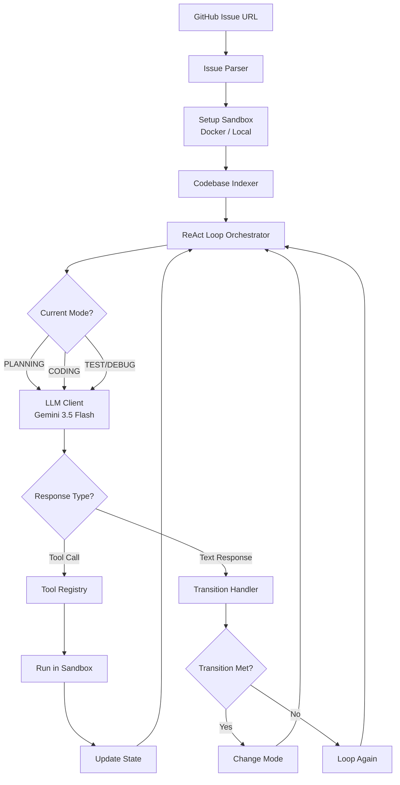

# autodev

An autonomous AI software agent that resolves GitHub issues end-to-end. It takes a GitHub issue URL, explores the codebase, plans the implementation, writes the code, runs tests, self-corrects on failures, and opens a pull request — fully autonomously.

---

## Key Features

- **Custom ReAct loop**: Built from scratch (no framework dependencies) for complete control and granular observability.
- **Twin-Mode Sandbox**: Executes commands in isolated **Docker containers** by default, with an automatic **native OS Python subprocess fallback** if Docker is unavailable.
- **Mode-Based Tool Filtering**: Directs the agent's focus by restricting tool access depending on the current phase (Planning, Coding, Testing, Debugging).
- **Codebase AST Indexer**: Indexes Python files using python's built-in `ast` module to build symbol tables containing class, function, and method definitions with line numbers.
- **Bulletproof File Edits**: Uses base64-encoded search-and-replace block operations to edit files without shell-escaping bugs or full-file rewrite costs.
- **Self-Correcting Debug Loop**: Automatically runs project test suites and uses stack trace outputs to recursively diagnose, patch, and re-test code up to a configurable retry budget.
- **Structured State Object**: Serializes and maintains complete execution history (modified files, test logs, error history, plan details) across LLM turns.

---

## System Architecture



For more details, see the [Architecture Documentation](docs/architecture.md).

---

## Project Structure

```
autodev/
├── src/
│   └── autodev/
│       ├── agent/          # ReAct orchestrator loop, prompts, state schema, and phase modes
│       ├── evaluation/     # Benchmark evaluations (SWE-bench evaluation runner)
│       ├── github/         # Issue fetching, PR generation, and GitHub integration
│       ├── llm/            # LLM client integration and settings
│       ├── sandbox/        # Isolated Docker sandbox and local subprocess workspaces
│       └── tools/          # Agent toolkit (file read/write/edit, grep, git status/diff, codebase indexer)
├── tests/                  # Pytest suite for sandboxing, tools, and agent React loops
├── Dockerfile              # Docker sandbox base image setup
├── pyproject.toml          # uv package configuration and project dependencies
└── README.md               # Project documentation
```

---

## Tech Stack

| Component | Technology | Rationale |
|---|---|---|
| **LLM Provider** | **Gemini 3.5 Flash** / **Gemini 3.1 Pro Preview** | Low latency, large context window, structured JSON schemas |
| **API SDK** | **google-genai** | Official, lightweight Python SDK |
| **Sandbox Environment** | **Docker Containers** / **Subprocess** | Secure isolation, flexible local development |
| **CLI Framework** | **Typer** + **Rich** | Type-safe CLI parameters, styled terminal dashboards |
| **Package Manager** | **uv** | Lightning-fast dependency resolution and virtual environments |
| **GitHub Integration** | **PyGithub** | Programmatic repository, issue, and pull request manipulation |

---

## Setup and Installation

### Prerequisites

- Python 3.10+
- [uv](https://github.com/astral-sh/uv) (recommended)
- Docker (optional, for containerized sandbox execution)

### Installation

1. Clone the repository:
   ```bash
   git clone https://github.com/arman1o1/autodev.git
   cd autodev
   ```

2. Install dependencies:

   Using **uv** (recommended):
   ```bash
   uv sync
   ```

   Or using standard **pip**:
   ```bash
   python -m venv .venv
   # On macOS/Linux:
   source .venv/bin/activate
   # On Windows:
   .venv\Scripts\activate

   pip install -r requirements.txt
   ```

3. Create your `.env` file from the template:
   ```bash
   cp .env.example .env
   ```

4. Configure your `.env` file:
   ```env
   GEMINI_API_KEY=your_gemini_api_key_here
   GITHUB_TOKEN=your_github_token_here
   ```

---

## Running the Application

### 1. Solve a GitHub Issue
To run the agent autonomously against a public or private GitHub issue:
```bash
uv run autodev solve https://github.com/owner/repo/issues/123
```

To run with **human-in-the-loop (interactive) checkpoints** where the agent pauses and requests approval for the implementation plan:
```bash
uv run autodev solve https://github.com/owner/repo/issues/123 --interactive
```

### 2. Index a Codebase
To extract symbol tables (classes, functions, methods, line numbers) from a local codebase directory:
```bash
uv run autodev index src/autodev
```

### 3. Run Evaluation Benchmarks
To run evaluation sets (curated SWE-bench Lite subsets or custom issue lists) and aggregate success metrics:
```bash
uv run autodev eval benchmarks/swe_bench_subset.json
```

---

## Testing

Run the test suite containing sandbox validation, agent ReAct loop simulation, and evaluation runner unit tests:
```bash
uv run pytest -v
```
