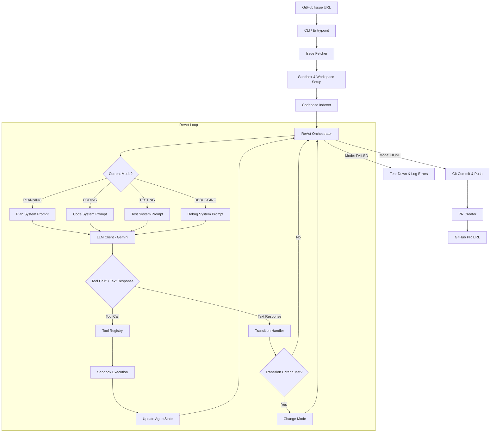

# autodev — Architecture Documentation

This document describes the system architecture and data flows of the `autodev` autonomous coding agent.

## System Overview

`autodev` is an autonomous coding agent designed to solve GitHub issues. It decomposes the solving process into four distinct execution modes: **Planning**, **Coding**, **Testing**, and **Debugging**. 

The architecture is built around a custom ReAct (Reasoning and Action) loop that executes inside an isolated sandbox environment.

---

## Core Components

### 1. CLI Entrypoint (`autodev.cli`)
- Managed using `Typer` and formatted using `Rich`.
- Exposes commands:
  - `autodev solve <issue_url>`: Main solver pipeline.
  - `autodev index <repo_path>`: Extract AST symbols from a local codebase.
  - `autodev eval <benchmark_file>`: Run evaluation benchmarks.

### 2. Configuration Management (`autodev.config`)
- Uses `pydantic-settings` to load configuration from environment variables and `.env` files.
- Ensures API keys, sandbox resource boundaries, timeout lengths, and execution modes are type-checked and validated at startup.

### 3. Sandbox & Workspace Manager (`autodev.sandbox`)
- **Docker Mode**: Boots a detached, resource-limited (`mem_limit`) Docker container running `tail -f /dev/null`. Command execution is performed via `exec_run` wrapped in a shell `timeout` utility to prevent hangs.
- **Local Fallback Mode**: If Docker is not running or accessible, the manager seamlessly falls back to a host directory (`workspaces/<workspace_id>/repo`), executing commands via python `subprocess` with timeout constraints.

### 4. Codebase understanding (`autodev.tools.codebase`)
- Recursively walks target repositories.
- Parses Python source files using Python's standard `ast` module.
- Extracts classes, top-level functions, and class methods along with their line numbers.
- Returns a structured symbol table mapped to JSON for prompt injection.

### 5. Tool Registry (`autodev.tools`)
- Aggregates tools defined in `WorkspaceToolKit`.
- Performs mode-based tool subset filtering:
  - `PLANNING` mode is restricted to read-only tools.
  - `CODING` mode is restricted to edit and diff tools.
  - `TESTING` mode is restricted to shell execution and directory listings.
  - `DEBUGGING` mode has access to both editing and test execution tools.
- Handles dynamic parameter binding, validation, and serialization.

---

## Context & Memory Management

To avoid context window blowup and maintain state coherence:
1. **AgentState**: A structured Pydantic object tracks the execution history, current mode, attempt number, modified files (with diff records), test history, and encountered errors.
2. **Context Injection**: The `AgentState.to_formatted_summary()` is injected into the user prompt at the beginning of *every* loop turn. This keeps the model aware of its state across turns.
3. **Manual History Management**: Conversation turns (messages) are managed as a list of `types.Content` objects. Old tool call sequences can be pruned or summarized, while key facts are preserved inside the structured `AgentState`.
